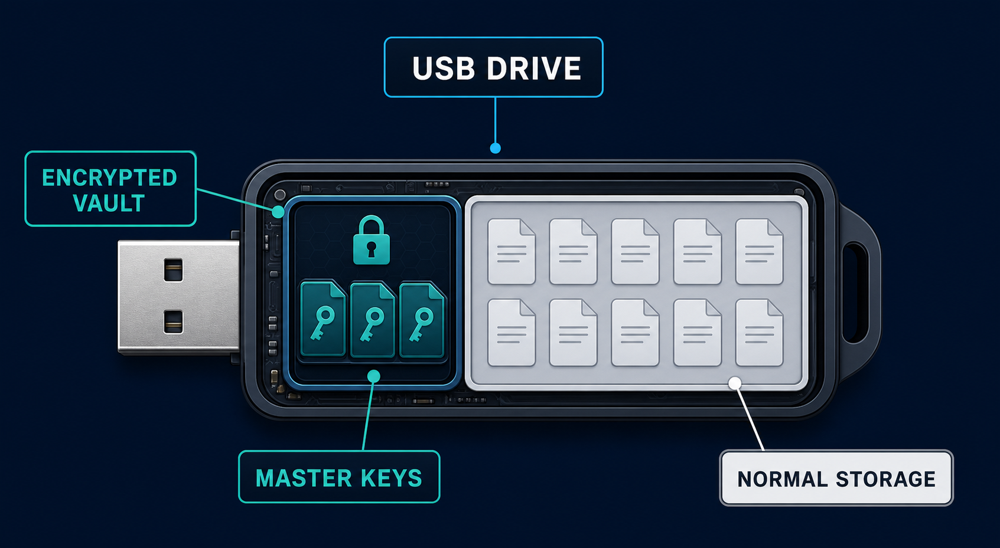
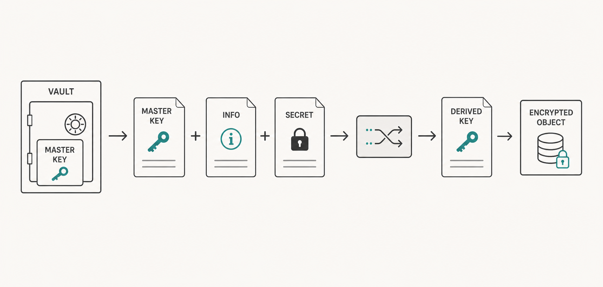
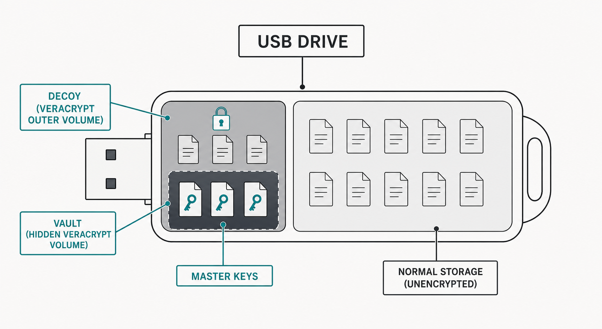

# Xilent Secure Vault (XSV)

## 1. Secure Storage Without Unnecessary Complexity

**Xilent Secure Vault (XSV)** is a practical model for securely storing sensitive private data. It is designed for security-conscious families, technology enthusiasts, and other advanced users.

Its goal is not to be the most extreme or complex security solution available. Instead, XSV aims for a deliberate balance: strong, sensible protection that remains manageable in everyday life. In other words, a practical and user-friendly way of achieving strong security.

A core principle is **long-term recoverability**. Your keys should be possible to recreate in the future—even from paper copies, and even if all current XSV code disappears. The algorithm and implementation details are _publicly documented_ so that a compatible recovery script can be recreated when needed.

XSV is built around the idea that you stay in control:
- Your sensitive data can remain offline.
- You do not need to depend on a cloud service.
- You do not need to preserve complicated digital key backups forever.
- The most important secrets can be recovered from understandable, documented information.

It's free. It's open source. And it's open for scrutiny. We all deserve some piece of mind, knowing our data is (reasonably) safe.

> [!IMPORTANT]
> XSV is a security model, not a guarantee against every threat. Use it only after understanding its trade-offs and adapting it to your own risk level.

## 2. How to Use Derived Keys

A **master key** is kept safely in the Vault. Rather than using it directly, generate a unique **derived key** for every protected object, such as an encrypted backup, archive, or VeraCrypt volume.

A derived key is a deterministic, high-entropy value calculated from a master key, an info string, and a memorized secret. It can be used as a **very strong password** or passphrase without needing to memorize or permanently store the resulting value.

The typical process is:

1. Unlock and mount the Vault.
2. Run **Derive Key** using XVault or the included Python script.
3. Select the master key to use.
4. Enter an **info string** that identifies the protected object, for example `FamilyPhotosBackup-2026` or `LaptopRecoveryArchive`.
5. Enter a unique memorized secret for that specific info string.
6. Copy the derived password and use it to unlock or encrypt the object.

A derived key can be used as the password for:

- An encrypted ZIP or 7-Zip archive
- An encrypted backup configuration
- A VeraCrypt volume
- A password-protected document or database
- Any other object that accepts a strong password

> [!TIP]
> Use a clear, stable info string and a unique memorized secret for each protected object. Both are required to recreate the same derived key later.

> [!IMPORTANT]
> Do not store the derived password unless you specifically need to. The benefit of XSV is that it can be regenerated from the master key, info string, and memorized secret.

## 3. Installation and Configuration

> [!NOTE]
> XSV is a security concept, not a requirement to use specific hardware or software. XVault, VeraCrypt, Bitwarden, USB drives, and the included Python script are practical recommendations only. You may use other storage media, applications, password managers, or key-derivation scripts, provided that you preserve the essential model: securely stored master keys, unique derived keys, documented recovery details, and protected paper copies of the information needed for recovery.

### Step 1 — Create the Vault

The recommended setup uses an encrypted USB drive, for example with [VeraCrypt](https://www.veracrypt.fr/).

A practical layout is:

| Storage area | Recommended size | Purpose |
|---|---:|---|
| **Decoy:** VeraCrypt outer volume | 200–400 MB | Contains the Decoy volume and hidden Vault volume |
| **Vault:** Hidden VeraCrypt volume | 20–50 MB | Stores the real sensitive Vault data |
| **Normal storage:** Standard USB partition | Remaining space | Normal, unencrypted everyday storage |

You can store a Vault anywhere, but placing it on unencrypted storage reduces its security.

This layout provides useful discretion:

- Most of the USB drive can be used normally without a password.
- The encrypted area can remain unmounted and inconspicuous.
- A small encrypted area is less likely to attract attention than a USB drive that is entirely inaccessible.
- VeraCrypt’s hidden-volume feature allows a separate **Decoy** volume to be opened if you are forced to reveal a password.

Recommended volume setup:

1. Create a standard VeraCrypt outer volume named `VaultDecoy`.
2. Create a hidden VeraCrypt volume named `Vault` inside it.
3. Create a `VaultKey` and use it as a keyfile for both volumes.
4. Leave the `VaultDecoy` password empty.
5. Protect the hidden `Vault` with a strong passphrase—preferably at least six randomly chosen words.
6. Store `VaultKey` locally on the computer that will use the Vault.

For the memorized secret, a password manager such as [Bitwarden](https://bitwarden.com/) is recommended. It provides a practical place to create and retain a strong multi-word passphrase.

> [!WARNING]
> An empty-password Decoy volume is not a complete protection against coercion, forensic investigation, malware, or a determined attacker. Treat it as one layer in a broader security model.

### Step 2 — Use the XVault Application *(optional)*

The **XVault** application is optional but recommended when available. It simplifies day-to-day Vault management, key creation, derivation, and configuration.

If you use XVault, configure the Vault device with an `.xvault` configuration file so the application can identify and work with the intended Vault setup. See [README_App.md](README_App.md) for application and configuration details.

### Step 3 — Create Master Keys

Create one or more master keys and store them in the Vault as `.mkf` files.

Use the included Python script, or use the corresponding feature in XVault when it becomes available in the first beta release.

Keep the recoverable information required to recreate important keys as a paper copy in a secure physical location.

## 4. How It Works

XSV uses publicly documented algorithms and implementation details so that keys can be recreated without depending on a specific application, cloud service, or long-lived proprietary format.

The intended recovery path is deliberately simple:

1. Keep the real key material or recovery data on paper.
2. Use the documented algorithm to recreate the required master key.
3. Combine the master key, info string, and memorized secret to recreate a derived key.
4. Rebuild a compatible script if the original tooling no longer exists.

This is a practical trade-off. XSV favors security that can realistically be operated and recovered by a private individual or family over maximum theoretical resistance at any cost.

### Three-Factor Protection

A typical XSV setup combines three separate factors:

| Factor | Example | Role |
|---|---|---|
| Something you know | A memorized passphrase | Unlocks the real Vault |
| Something you have | The physical USB drive | Holds the encrypted Vault |
| Something stored locally | `VaultKey` on the computer | Supports access to the Vault |

An attacker should need access to all relevant factors, not merely one of them.

### Multiple Vaults and Computer-Specific Setups

You can use multiple independent Vaults, for example by using different USB drives for different purposes.

You can also use a unique combination of:

- USB Vault device
- Local `VaultKey`
- Memorized passphrase

for each computer. This limits the impact if one device or computer is lost or compromised.

### Disposable by Design

A Vault is intended to be disposable.

The Vault itself, its `VaultKey`, and its memorized secret do not need to exist forever. A new Vault can be created whenever needed.

If a Vault is deleted, lost, or intentionally destroyed, only the actual master keys need to be recreated—using the protected paper copies of the key recovery information.

### Limitations

XSV is useful when you want offline storage, practical recovery, and control over your own data. It is not fail-proof.

It may not protect you adequately against:

- Malware or keyloggers on the local computer.
- Theft of the USB drive together with the local `VaultKey`.
- Compromise of the password manager or memorized passphrase.
- Physical coercion or sophisticated forensic analysis.
- Poor handling of paper backups.
- Operational mistakes, such as mounting the real Vault on an untrusted computer.

Use dedicated, trusted devices where possible, protect paper recovery copies carefully, and review your setup periodically.

## 5. License

XSV source code, documentation, diagrams, and configuration examples are licensed under the [Apache License 2.0](LICENSE). See [NOTICE](NOTICE) for attribution information.
